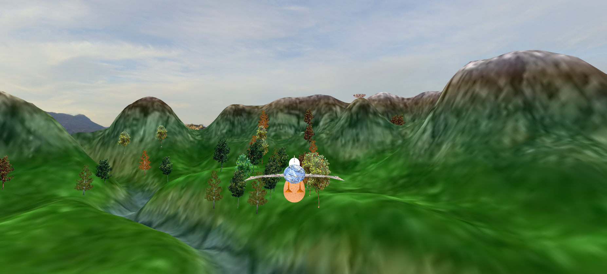
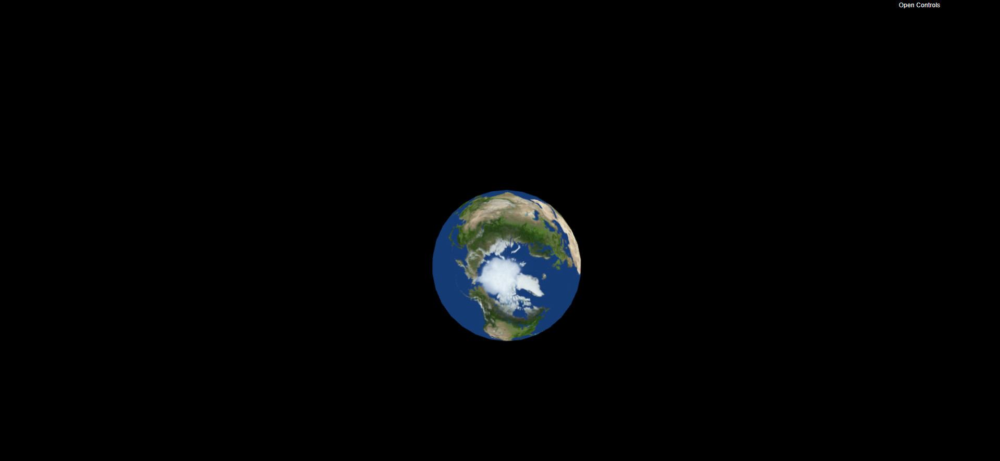
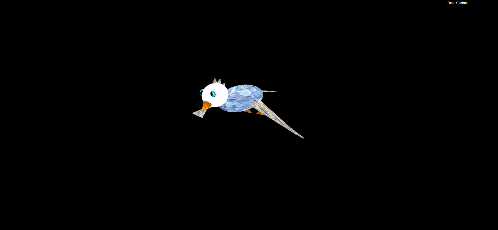
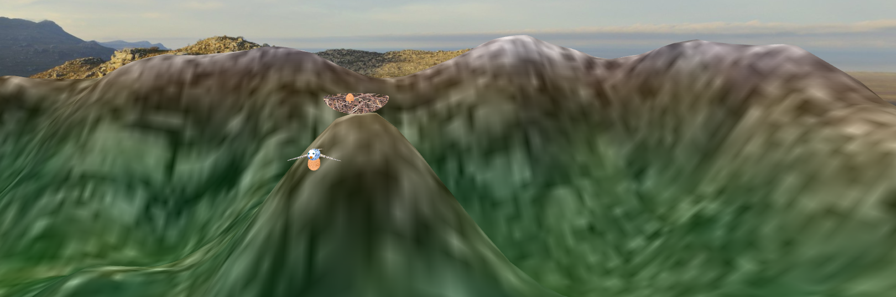

# Bird Game


**An interactive WebGL bird simulation with procedural terrain and environmental rendering.**

This project implements a complete 3D bird simulation using raw WebGL, demonstrating shader programming, procedural generation, and environmental rendering techniques without relying on high-level frameworks.



## Quick Start

Open `index.html` in a browser supporting WebGL 2.0.

## Why Raw WebGL

Framework-free WebGL development provides direct control over graphics pipeline stages, enabling optimization at the shader and buffer level. This implementation demonstrates low-level graphics programming competency including manual vertex buffer management, custom shader development, and efficient rendering techniques.

## Features

**Environmental Rendering**
- Procedurally generated terrain with height mapping
- Skybox panorama for immersive backgrounds
- Tree placement with multiple texture variants
- Atmospheric rendering with distance fog

**Bird System**
- Animated bird model with wing articulation
- Flight path calculations with smooth interpolation
- Nest and egg object interaction
- Camera tracking for cinematic presentation

**Technical Implementation**
- Custom WebGL rendering pipeline without frameworks
- GLSL shaders for vertex transformation and fragment coloring
- Procedural terrain generation using noise functions
- Texture management and UV coordinate mapping
- Matrix transformation calculations for object positioning

## Getting Started

### Prerequisites

Modern web browser with WebGL 2.0 support:
- Chrome 56+
- Firefox 51+
- Safari 15+
- Edge 79+

### Running the Application

1. Clone or download the repository
2. Navigate to the project directory
4. Open `index.html` in your browser

### Project Structure

```
project/
├── index.html
├── shaders/
│   ├── terrain.vert
│   └── terrain.frag
├── images/
├── main.js
└── [additional modules]
└── Screenshots/
```

## Technical Implementation

**WebGL Pipeline**  
The application initializes WebGL context with depth testing and backface culling enabled. Vertex and fragment shaders compile at runtime, with attribute locations bound to buffer objects for geometry data. The render loop executes draw calls with appropriate state configuration for each object type.

**Shader System**  
Vertex shaders perform model-view-projection transformations using manually calculated matrices. Fragment shaders apply texture sampling and lighting calculations per pixel. Uniform variables pass camera position, light direction, and material properties to shaders.

**Terrain Generation**  
Procedural height maps generate terrain geometry using Perlin or simplex noise functions. Vertex positions calculate from noise values, with normals derived for proper lighting. Texture coordinates map based on world position for seamless tiling.

**Bird Animation**  
Wing articulation uses rotation matrices applied to mesh vertices. Flight paths follow spline curves with position interpolation per frame. The camera system tracks bird position with smooth following behavior using exponential smoothing.

**Tree Distribution**  
Tree placement uses Poisson disk sampling for natural distribution patterns. Multiple texture variants prevent repetition. Billboard rendering optimizes tree geometry by orienting quads toward camera position.

**Texture Management**  
Image loading handles asynchronous texture creation with fallback defaults. Mipmaps generate automatically for distant object rendering. Texture units bind before draw calls with appropriate filtering modes.

## System Architecture

The codebase organizes functionality into discrete modules:

**WebGL Context Management** handles initialization and state configuration  
**Shader Compilation** loads, compiles, and links shader programs  
**Geometry Generation** creates vertex and index buffers for objects  
**Scene Graph** maintains object hierarchies and transformations  
**Render Loop** orchestrates drawing operations and frame timing

This modular structure enables independent testing and modification of rendering components.

## Technology Stack

- WebGL 2.0 for GPU rendering
- GLSL ES 3.00 for shader programming
- JavaScript ES6+ for application logic
- Custom matrix and vector mathematics
- Procedural generation algorithms

## Screenshots

**Sphere Primitive**  


**Panoramic Environment - Skybox**  


**Bird Model**  


**Terrain with Background**  


**Nest and Eggs**  


**Tree System**  


## Assets and Attribution

Tree textures sourced from:
- https://www.freepnglogos.com/images/tree-plan-27860.html
- https://www.pngall.com/tree-png/download/23754

Panorama textures created for this project.

## Development Context

This project was developed for the Computer Graphics course, demonstrating competency in low-level graphics programming using WebGL without frameworks. The implementation required manual pipeline management, shader development, and optimization techniques typical of production rendering engines.

The project showcases understanding of graphics fundamentals including transformation matrices, texture mapping, lighting calculations, and rendering optimization strategies.

## License

Academic project for Computer Graphics course 2022/2023. All rights reserved.
